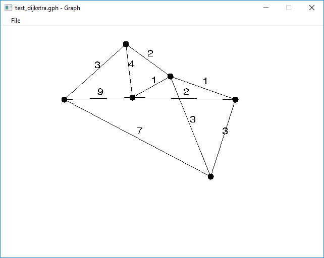
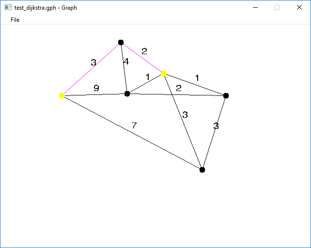
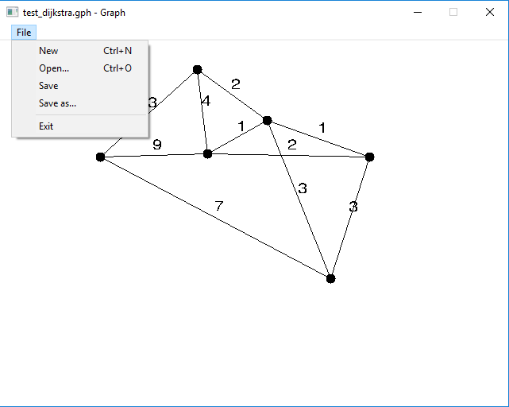

# Graphs

Dieses Program ist meine große Hausaufgabe für das Lehrfach 'Grundlagen der Programmierung'.

Ich habe die sogenanntes Dijkstra algorithmus implementiert, und auch eine Program mit graphisches Benutzeroberfläche geschrieben, damit man die Graphen zeichnen kann. Die programm ist in C geschrieben.

# Dokumentazion für Benutzer
Die Graphen können sehr einfach gezeichnet werden.

eine linke Maustaste addiert eine neue Knote, und die doppelte linke Maustaste löscht die Kante unter dem Kursor

Zwei Kanten können mit rechte Maustaste verbindet verden. Um eine Kante zu wählen soll man die Kante mit rechte Maustaste kreuzen. Die Koste der Kante kann mit Tippen an der Tastatur modifiziert werden. Der Knopf `d` löscht die gewählte Kante.



Die Algoritmus kann mit dem Knopf `r` gestartet werden. Dann muss man zwei Knoten wählen zwischen die, die kürzeste Weg gefundet werden wird. Die kürzeste Weg wird mit pink bezeichnet.



Die Graphen können im Menu 'File' gespeichert werden können.



# Dokumentazion für Programmierer

Filestruktur

Name       | Funkzion
-----      | -----
algorithms | Implementazion von Dijkstra 
draw       | SDL, Zeichnung
file       | Filemanagement
graph      | Implementazion von den Graphen 
loop       | 'Spiele-Schleifen' 
main.c | Eintrittspunkt, Initalizierung
vector_math | Hilfsfunkzionen für Vector-Arthimetik
window  | WIN32 API

## algoritmus.h

```c
void run_dijkstra(Graph* graph, int start, int end);
```
läuft den Algorithmus auf den Graph `graph` und zeigt die kürzeste Weg von `start` bis `end`

## draw.h

```c
void fill_circle(int x, int y, int radius, int r, int g, int b, int a);
```
Füllt eine Kreis im Punkt (`x`, `y`) mit radius `radius` mit dem Färbe definiert von `r`, `g`, `b`, `a` 

```c
int load_global_font(const char* path);
```
Festgelegt die benutzte Schrifttyp

```c
void draw_text(int x, int y, const char* text);
```
Schreibt auf den Bildschirm

```c
int create_edge_text_info();
int update_edge_text_info(int);
int update_all_edge_text_info();
```
Erschafft/updatet Informazionen die wichtig sind um eine/alle Kante zu zeigen

## file.h

```c
int save_graph(Graph* graph, const char* path);
```
Speichert die Graph `graph` im File `path`

```c
Graph* load_graph(const char* path);
```

Ladet eine Graph von `path`

## graph.h

```c
struct {
	int x;
	int y;
} typedef Vertex;
```
Definiert eine Knote

```c
struct {
	int v1;
	int v2;
	int weight;
} typedef Edge;
```
Definiert eine Kante

```c
struct {
	SDL_Texture* texture;
	SDL_Rect rect;
	unsigned length;
	int highlight; //dijkstra
} typedef EdgeTextInfo;
```
Speichert interne Informazionen über eine Kante

```c
struct {
	int numberOfVertices;
	int numberOfEdges;
	Vertex* vertices;
	Edge* edges;
	EdgeTextInfo* edgeInfo;
	int flags;
} typedef Graph;
```
Definiert eine Graph

```c
Graph* create_graph(int numOfVertices, int numOfEdges, int flags, ...);
```
Herstellt eine Graph mit `numOfVertices` Knoten, `numOfEdges` Kanten.
`flag` ist nicht benutzt.
Die Kanten werden zwischen die Knoten, die als Argument gegeben werden sein.

```c
void destroy_graph(Graph* graph);
```
Löscht die Graph `graph`.

```c
void append_vertex(Graph* graph, int x, int y);
```
Addiert eine Knote zum Graph

```c
void append_edge(Graph* graph, int v1, int v2);
```
Addiert eine Kante zum Graph

```c
void delete_vertex(Graph* graph, int i);
```
Löscht eine Knote vom Graph

```c
void delete_edge(Graph* graph, int edge);
```
Löscht eine Kante vom Graph

## loop.h

```c
extern SDL_Window* gWindow;
```
Eine globale Variable für das SDL Window

```c
extern Graph* gGraph;
```
Globale Variable für die Graph

```c
extern SDL_Renderer* gRenderer;
```
Renderer von SDL

```c
void draw();
```
Dieses Funkzion zeigt die Graph auf den Bildschirm

```c
void gameInit();
```
Initaliziert die Program

```c
void gameClose();
```
Schließt die Program

```c
void update(SDL_Event e, int ticks);
```
Handelt die Benutzerinput

## vector_math.h

```c
struct {
	int x;
	int y;
} typedef Vector2i;
```
Vektor mit integer-Koordinaten

```c
struct {
	double x;
	double y;
} typedef Vector2d;
```
Vektor mit double-Koordinaten

```c
Vector2d intersect_lines(int x1, int y1, int x2, int y2, int x3, int y3, int x4, int y4);
```
Kalkuliert den Schnitt zweier Linien