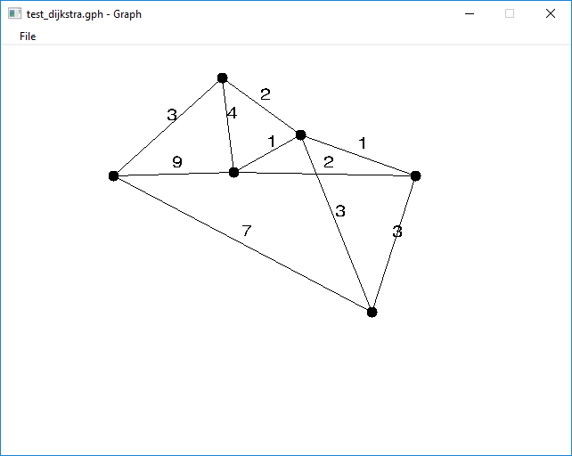

# Graphs

Dieses Program ist meine große Hausaufgabe für das Lehrfach 'Grundlagen der Programmierung'.

Ich habe den Dijkstra-Algorithmus implementiert, und auch eine Program mit graphisches Benutzeroberfläche geschrieben, damit man eine Graph zeichnen kann. Die programm wurde in C geschrieben.

Dieses Projekt ist auf [Github](https://github.com/bugdi/graphs) aufgeladet.

# Dokumentazion für den Benutzer
Die Graphen können sehr einfach gezeichnet werden:

eine linke Maustaste addiert eine neue Knote, und die doppelte linke Maustaste löscht die Knote unter dem Kursor

Zwei Kanten können mit rechte Maustaste verbindet verden. Um eine Kante zu wählen soll man die Kante mit rechte Maustaste kreuzen. Die Koste der Kante kann mit Tippen an der Tastatur modifiziert werden. Der Knopf `d` löscht die gewählte Kante.

Die Algoritmus kann mit dem Knopf `r` gestartet werden. Dann muss man zwei Knoten wählen zwischen die, die kürzeste Weg gefundet werden wird. Die kürzeste Weg wird mit pink bezeichnet.

Die Graphen können im Menu 'File' gespeichert werden können.

